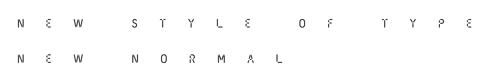

# New Style of Type (New Normal)

[Download](https://github.com/dainippon-type/NewStyleOfType/releases)

---

OpenTypeフォント 「新しい書体様式」を提案します

## 新しい書体様式

### 特徴
 - **接触を避ける。交わらない**
   - エレメントの交差部分を無くしました。
 - **間隔を開ける**
   - Illustratorなどのアプリケーションでカーニング設定を「自動」にすると、字間が広がります。
 - **wオーバーシュートさせない**
   - ベースラインなどからオーバーシュ=トする箇所をカットしました。
 - **オンラインを活用する**
   - [ここ](https://github.com/dainippon-type/NewStyleOfType/releases)からダウンロードすることができます。

このバージョンでは、大文字と数字しかありません。小文字などは次のアップデートで追加予定です。

---

We propose OpenType font "New Style of Type (New Normal)".

## New Style of Type (New Normal)

### Features
 - **Avoid contact. Do not intersect**
   - Remove the intersection of elements.
 - **Wider Spacing**
   - On Illustrator app, set the kerning setting to "Auto" to be wider the space between characters.
 - **Anti-overshoot**
   - Cutted the parts over the line. (ex. Upper and lower curves such as "O", and the upper part of "A")
 - **Using Online**
   - You can Download [here](https://github.com/dainippon-type/NewStyleOfType/releases).

This version has only uppercase letters and numbers. More will be added in the next update.

(c) 2020 dainippon type organization. all rights reserved. http://dainippon.type.org/
